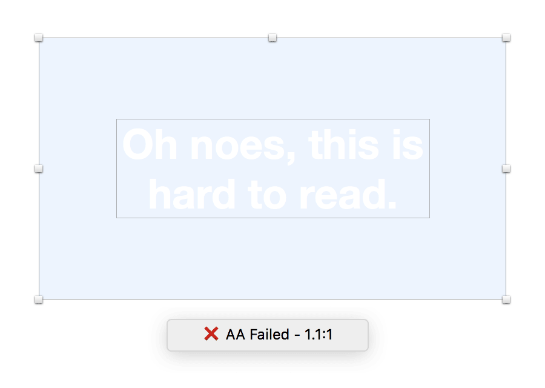

# Color Contrast Analyser for Sketch

A Sketch plugin that calculates the color contrast of two layers and evaluates it against the WCAG. The test may pass AAA, AA or fail because of a lack of contrast. And even when you do not need to meet those requirements, you can get a feeling for the contrast when you get used to the values. This might help you design accessible content.

Update: Also works with single layers that are now checked against the artboard background color.

Note: This plugin works with solid text and fill colors. Transparency is not supported yet.

### AA requirements
Color contrast of **4.5:1** or **3.0:1 for large text**

### AAA requirements
Color contrast of **7.0:1** or **4.5:1 for large text**

_(Large text means regular text larger than 18pt or bold text larger than 14pt)_

Read more about the Web Content Accessibility Guidelines 2.0 
http://www.w3.org/WAI/WCAG20/quickref/#qr-visual-audio-contrast-contrast

Based on the algorithms described here: http://gmazzocato.altervista.org/colorwheel/algo.php